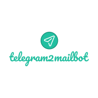

<h1 align="center">
	
</h1>

# telegram2mailbot

Simple telegram bot hosted on replit using flask, It forwards messages using the mailgun api.

## Register accounts + initial Setup

0.1 You will need an account(free) on <a target="_blank" rel="noopener noreferrer" href="https://replit.com/signup?from=landing">replit</a>  to host this project so it runs 24/7 in the cloud. The free tier is fine, make sure to use environment variables like described below.

0.2 You also need an account(free) with <a target="_blank" rel="noopener noreferrer" href="https://signup.mailgun.com/new/signup">mailgun</a> to use there api to send emails. Make a note of the <a target="_blank" rel="noopener noreferrer" href="https://i.ibb.co/bzg4RwR/tbot6.png">"private api key"</a> in settings &  <a target="_blank" rel="noopener noreferrer" href="https://i.ibb.co/870RhSY/tbot.png">your domain</a> (starts with "sandbox..mailgun.org") and finally add <a target="_blank" rel="noopener noreferrer" href="https://i.ibb.co/vXQXStr/tbot2.png">recipient email.</a> (If emails end up in spam you can create a custom rule on gmail etc)

0.3 Create a bot using <a target="_blank" rel="noopener noreferrer" href="https://t.me/BotFather">botfather</a> and get the telegram api. **Make a note of api key" before closing BotFather Chat**

## Set up and deploy bot on replit

1. Create <a target="_blank" rel="noopener noreferrer" href="https://i.ibb.co/yqFhsFH/tbot3.png">new project</a> using python. Name it anything.
2. Install the <a target="_blank" rel="noopener noreferrer" href="https://i.ibb.co/StGBtL8/tbot4.png">following packages:</a> (i) requests (ii) Flask (iii) pyTelegramBotAPI
3. Add <a target="_blank" rel="noopener noreferrer" href="https://i.ibb.co/vVHb7LV/tbot5.png">environment variables</a> (i) MAILGUN_KEY (ii) TELEGRAM_KEY (iii) URL
4. Copy code for main.py from this repo replace "<MAILGUN_DOMAIN>" with your domain
5. Create new file called keep_alive.py and copy the code from keep_alive.py into it.
6. Run code and test your bot. Bot should welcome you to the room and forward every message it receives to the email you specified.
7. You can publish the repl, run it and close the tab and your bot will keep running in the background 24/7 for free!!
